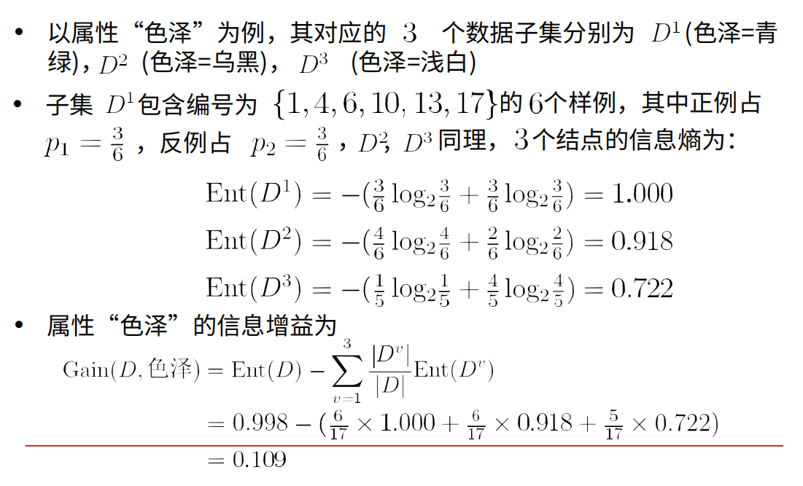

## 目录
- [1. 什么是决策树](https://github.com/NLP-LOVE/ML-NLP/tree/master/Machine%20Learning/3.Desition%20Tree#1-什么是决策树)
  - [1.1 决策树的基本思想](https://github.com/NLP-LOVE/ML-NLP/tree/master/Machine%20Learning/3.Desition%20Tree#11-决策树的基本思想)
  - [1.2 “树”的成长过程](https://github.com/NLP-LOVE/ML-NLP/tree/master/Machine%20Learning/3.Desition%20Tree#12-树的成长过程)
  - [1.3 "树"怎么长](https://github.com/NLP-LOVE/ML-NLP/tree/master/Machine%20Learning/3.Desition%20Tree#13-树怎么长)
  - [1.3.1 ID3算法](https://github.com/NLP-LOVE/ML-NLP/tree/master/Machine%20Learning/3.Desition%20Tree#131-id3算法)
  - [1.3.2 C4.5](https://github.com/NLP-LOVE/ML-NLP/tree/master/Machine%20Learning/3.Desition%20Tree#132-c45)
  - [1.3.3 CART算法](https://github.com/NLP-LOVE/ML-NLP/tree/master/Machine%20Learning/3.Desition%20Tree#133-cart算法)
  - [1.3.4 三种不同的决策树](https://github.com/NLP-LOVE/ML-NLP/tree/master/Machine%20Learning/3.Desition%20Tree#134-三种不同的决策树)
- [2. 树形结构为什么不需要归一化?](https://github.com/NLP-LOVE/ML-NLP/tree/master/Machine%20Learning/3.Desition%20Tree#2-树形结构为什么不需要归一化)
- [3. 分类决策树和回归决策树的区别](https://github.com/NLP-LOVE/ML-NLP/tree/master/Machine%20Learning/3.Desition%20Tree#3-分类决策树和回归决策树的区别)
- [4. 决策树如何剪枝](https://github.com/NLP-LOVE/ML-NLP/tree/master/Machine%20Learning/3.Desition%20Tree#4-决策树如何剪枝)
- [5. 代码实现](https://github.com/NLP-LOVE/ML-NLP/blob/master/Machine%20Learning/3.Desition%20Tree/DecisionTree.ipynb)

## 1. 什么是决策树

### 1.1 决策树的基本思想

其实用一下图片能更好的理解LR模型和决策树模型算法的根本区别，我们可以思考一下一个决策问题：是否去相亲，一个女孩的母亲要给这个女海介绍对象。

大家都看得很明白了吧！LR模型是一股脑儿的把所有特征塞入学习，而决策树更像是编程语言中的if-else一样，去做条件判断，这就是根本性的区别。

### 1.2 “树”的成长过程

决策树基于“树”结构进行决策的，这时我们就要面临两个问题 ：

- “树”怎么长。
- 这颗“树”长到什么时候停。

弄懂了这两个问题，那么这个模型就已经建立起来了，决策树的总体流程是“分而治之”的思想，一是自根至叶的递归过程，一是在每个中间节点寻找一个“划分”属性，相当于就是一个特征属性了。接下来我们来逐个解决以上两个问题。

#### 这颗“树”长到什么时候停

- 当前结点包含的样本全属于同一类别，无需划分；例如：样本当中都是决定去相亲的，属于同一类别，就是不管特征如何改变都不会影响结果，这种就不需要划分了。
- 当前属性集为空，或是所有样本在所有属性上取值相同，无法划分；例如：所有的样本特征都是一样的，就造成无法划分了，训练集太单一。
- 当前结点包含的样本集合为空，不能划分。

### 1.3 "树"怎么长

在生活当中，我们都会碰到很多需要做出决策的地方，例如：吃饭地点、数码产品购买、旅游地区等，你会发现在这些选择当中都是依赖于大部分人做出的选择，也就是跟随大众的选择。其实在决策树当中也是一样的，当大部分的样本都是同一类的时候，那么就已经做出了决策。

我们可以把大众的选择抽象化，这就引入了一个概念就是纯度，想想也是如此，大众选择就意味着纯度越高。好，在深入一点，就涉及到一句话：**信息熵越低，纯度越高**。我相信大家或多或少都听说过“熵”这个概念，信息熵通俗来说就是用来度量包含的“信息量”，如果样本的属性都是一样的，就会让人觉得这包含的信息很单一，没有差异化，相反样本的属性都不一样，那么包含的信息量就很多了。

一到这里就头疼了，因为马上要引入信息熵的公式，其实也很简单：

$$Ent(D)=-\sum_{k=1}^{|y|}p_klog_2p_k$$

Pk表示的是：当前样本集合D中第k类样本所占的比例为Pk。

**信息增益**

废话不多说直接上公式：

看不懂的先不管，简单一句话就是：划分前的信息熵--划分后的信息熵。表示的是向纯度方向迈出的“步长”。

好了，有了前面的知识，我们就可以开始“树”的生长了。

#### 1.3.1 ID3算法

解释：在根节点处计算信息熵，然后根据属性依次划分并计算其节点的信息熵，用根节点信息熵--属性节点的信息熵=信息增益，根据信息增益进行降序排列，排在前面的就是第一个划分属性，其后依次类推，这就得到了决策树的形状，也就是怎么“长”了。

如果不理解的，可以查看我分享的图片示例，结合我说的，包你看懂：

不过，信息增益有一个问题：对可取值数目较多的属性有所偏好，例如：考虑将“编号”作为一个属性。为了解决这个问题，引出了另一个 算法C4.5。

#### 1.3.2 C4.5

为了解决信息增益的问题，引入一个信息增益率：

$$Gain\_ratio(D,a)=\frac{Gain(D,a)}{IV(a)}$$

其中：

$$IV(a)=-\sum_{v=1}^{V}\frac{|D^v|}{|D|}log_2\frac{|D^v|}{|D|}$$

属性a的可能取值数目越多(即V越大)，则IV(a)的值通常就越大。**信息增益比本质： 是在信息增益的基础之上乘上一个惩罚参数。特征个数较多时，惩罚参数较小；特征个数较少时，惩罚参数较大。**不过有一个缺点：

- 缺点：信息增益率偏向取值较少的特征。

使用信息增益率：基于以上缺点，并不是直接选择信息增益率最大的特征，而是现在候选特征中找出信息增益高于平均水平的特征，然后在这些特征中再选择信息增益率最高的特征。

#### 1.3.3 CART算法

数学家真实聪明，想到了另外一个表示纯度的方法，叫做基尼指数(讨厌的公式)：

表示在样本集合中一个随机选中的样本被分错的概率。举例来说，现在一个袋子里有3种颜色的球若干个，伸手进去掏出2个球，颜色不一样的概率，这下明白了吧。**Gini(D)越小，数据集D的纯度越高。**

##### 举个例子

假设现在有特征 “学历”，此特征有三个特征取值： “本科”，“硕士”， “博士”，

当使用“学历”这个特征对样本集合D进行划分时，划分值分别有三个，因而有三种划分的可能集合，划分后的子集如下：

1.划分点： “本科”，划分后的子集合 ： {本科}，{硕士，博士}

2.划分点： “硕士”，划分后的子集合 ： {硕士}，{本科，博士}

3.划分点： “硕士”，划分后的子集合 ： {博士}，{本科，硕士}}

对于上述的每一种划分，都可以计算出基于 **划分特征= 某个特征值** 将样本集合D划分为两个子集的纯度：

$$Gini(D,A)=\frac{|D_1|}{|D|}Gini(D_1)+\frac{|D_2|}{|D|}Gini(D_2)$$

因而**对于一个具有多个取值（超过2个）的特征，需要计算以每一个取值作为划分点，对样本D划分之后子集的纯度Gini(D,Ai)，(其中Ai 表示特征A的可能取值)**

然后从所有的可能划分的Gini(D,Ai)中找出Gini指数最小的划分，这个划分的划分点，便是使用特征A对样本集合D进行划分的最佳划分点。到此就可以长成一棵“大树”了。

#### 1.3.4 三种不同的决策树

- **ID3**：取值多的属性，更容易使数据更纯，其信息增益更大。

  训练得到的是一棵庞大且深度浅的树：不合理。

- **C4.5**：采用信息增益率替代信息增益。

- **CART**：以基尼系数替代熵，最小化不纯度，而不是最大化信息增益。

## 2. 树形结构为什么不需要归一化?

因为数值缩放不影响分裂点位置，对树模型的结构不造成影响。
按照特征值进行排序的，排序的顺序不变，那么所属的分支以及分裂点就不会有不同。而且，树模型是不能进行梯度下降的，因为构建树模型（回归树）寻找最优点时是通过寻找最优分裂点完成的，因此树模型是阶跃的，阶跃点是不可导的，并且求导没意义，也就不需要归一化。

既然树形结构（如决策树、RF）不需要归一化，那为何非树形结构比如Adaboost、SVM、LR、Knn、KMeans之类则需要归一化。

对于线性模型，特征值差别很大时，运用梯度下降的时候，损失等高线是椭圆形，需要进行多次迭代才能到达最优点。
但是如果进行了归一化，那么等高线就是圆形的，促使SGD往原点迭代，从而导致需要的迭代次数较少。

## 3. 分类决策树和回归决策树的区别

Classification And Regression Tree(CART)是决策树的一种，CART算法既可以用于创建分类树（Classification Tree），也可以用于创建回归树（Regression Tree），两者在建树的过程稍有差异。

**回归树**：

CART回归树是假设树为二叉树，通过不断将特征进行分裂。比如当前树结点是基于第j个特征值进行分裂的，设该特征值小于s的样本划分为左子树，大于s的样本划分为右子树。 

而CART回归树实质上就是在该特征维度对样本空间进行划分，而这种空间划分的优化是一种NP难问题，因此，在决策树模型中是使用启发式方法解决。典型CART回归树产生的目标函数为：

因此，当我们为了求解最优的切分特征j和最优的切分点s，就转化为求解这么一个目标函数：

所以我们只要遍历所有特征的的所有切分点，就能找到最优的切分特征和切分点。最终得到一棵回归树。

参考文章：[经典算法详解--CART分类决策树、回归树和模型树](https://blog.csdn.net/jiede1/article/details/76034328)

## 4. 决策树如何剪枝

决策树的剪枝基本策略有 预剪枝 (Pre-Pruning) 和 后剪枝 (Post-Pruning)。

- **预剪枝**：其中的核心思想就是，在每一次实际对结点进行进一步划分之前，先采用验证集的数据来验证如果划分是否能提高划分的准确性。如果不能，就把结点标记为叶结点并退出进一步划分；如果可以就继续递归生成节点。
- **后剪枝**：后剪枝则是先从训练集生成一颗完整的决策树，然后自底向上地对非叶结点进行考察，若将该结点对应的子树替换为叶结点能带来泛化性能提升，则将该子树替换为叶结点。

参考文章：[决策树及决策树生成与剪枝](https://blog.csdn.net/am290333566/article/details/81187562)

## 5. 代码实现

GitHub：[https://github.com/NLP-LOVE/ML-NLP/blob/master/Machine%20Learning/3.Desition%20Tree/DecisionTree.ipynb](https://github.com/NLP-LOVE/ML-NLP/blob/master/Machine%20Learning/3.Desition%20Tree/DecisionTree.ipynb)

------

> 作者：[@mantchs](https://github.com/NLP-LOVE/ML-NLP)
>
> GitHub：[https://github.com/NLP-LOVE/ML-NLP](https://github.com/NLP-LOVE/ML-NLP)
>
> 欢迎大家加入讨论！共同完善此项目！群号：【541954936】
